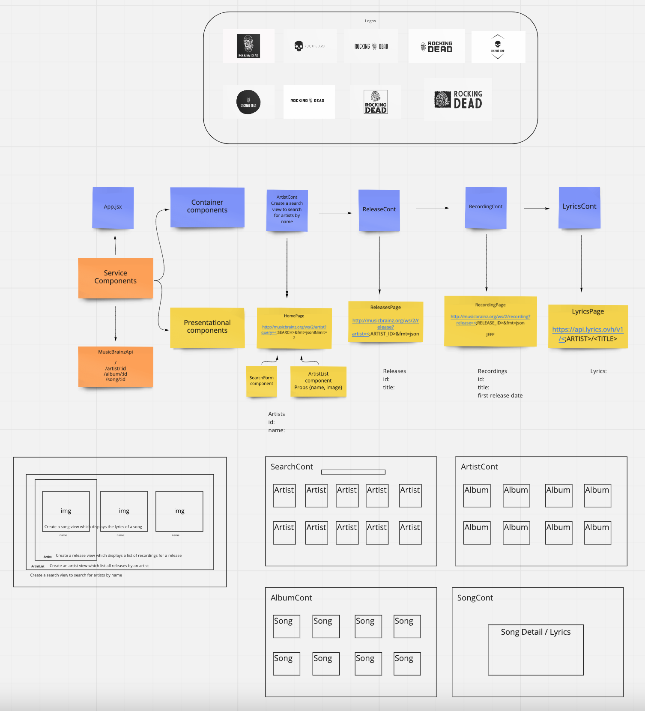

# Rocking Dead
This repo uses React to fetch data from the MusicBrainz and Lyrics API with custom hooks. The data can be searched by artist, viewed in a list of releases, recordinga and a detailed view of the song lyrics.

## APIs

* [MusicBrainz](https://musicbrainz.org/doc/MusicBrainz_API)
* [Lyrics](https://lyricsovh.docs.apiary.io/#reference/0/lyrics-of-a-song/search)

## Preplanning

* [Miro Board](https://miro.com/app/board/o9J_lU76Prw=/?userEmail=jillian.l.gibson@gmail.com&track=true&utm_source=notification&utm_medium=email&utm_campaign=add-to-team-and-board&utm_content=go-to-board)

